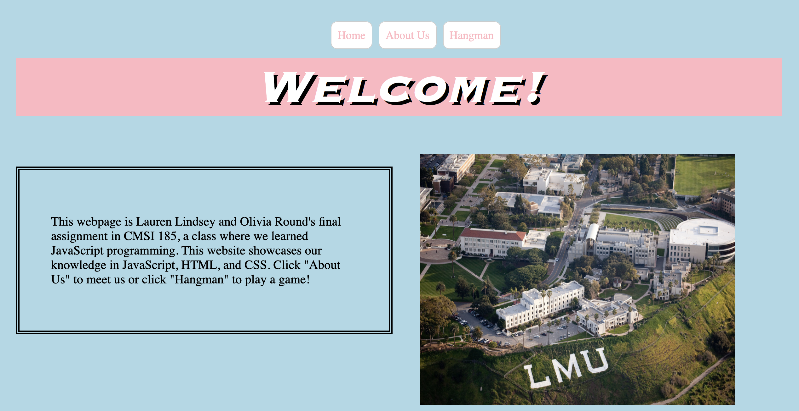
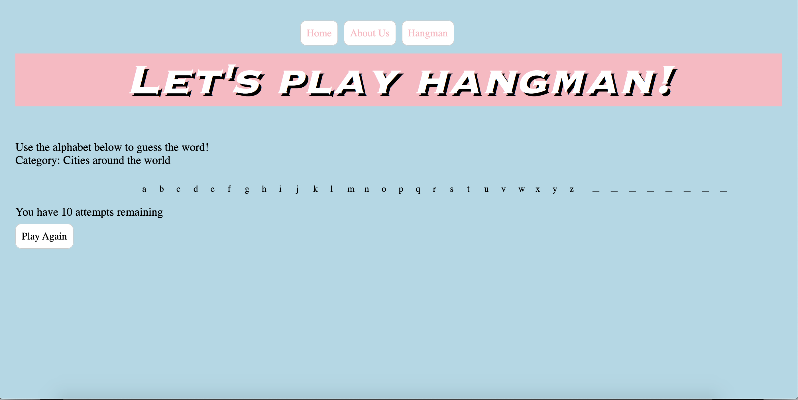

# Introduction to Computer Programming
Coursework from CMSI 185: Computer Programming completed at LMU

## Assignment
This website was a final project for my Introduction to Computer Programming course at LMU that utilized knowledge of JavaScript, CSS, and HTML to make a website. 

### Key Features
#### Home Page

#### About Us Page

#### WildCard Page
